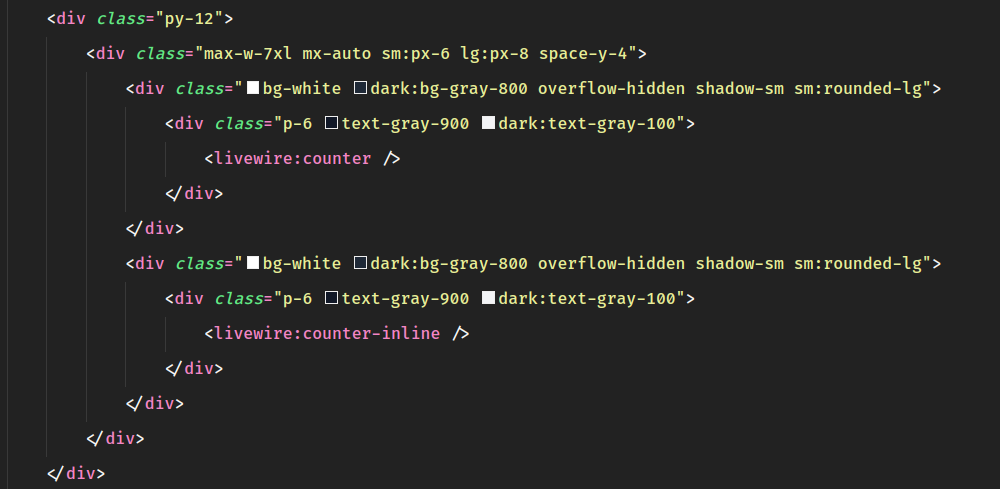

### Deep Dive in Livewire V3
- [Livewire](https://livewire.laravel.com/) A conexão entre o back-end e o front-end.
## LEIA A DOCUMENTAÇÃO ISSO É APENAS UM RESUMO 

Installing Livewire
```bash
composer require livewire/livewire
```
-- Versão 3.0.0
- Verificar app.js se houver importação do Alpine.js remover, pois o Livewire já vem com o Alpine.js.
### Criando um componente Livewire
Existem duas maneiras de criar um componente Livewire.
```bash
php artisan make:livewire counter
```
O comando acima criará um componente Livewire em `app/Livewire/Counter.php` e um arquivo de visualização em `resources/views/livewire/counter.blade.php`.

```bash
php artisan make:livewire counter-inline --inline
```
O comando acima criará um componente Livewire em `app/Livewire/CounterInline.php`.

### Renderizando um componente Livewire


### Propriedades
```php
class Counter extends Component
{
    public $counter = 0; // isso é propiedade

    public function render()
    {
        return view('livewire.counter');
    }
}
```
- Uma propiedade publica sempre esta disponivel na view.
- Possui comunicação bidirecional, ou seja, se alterar na view altera na propiedade e vice-versa.
- A propriedade pode ser passada como parametro para o componente.
```php
<livewire:counter :counter="10" />
```

#### Inicializando propriedades
```php
class Counter extends Component
{
    public $counter;

    public function mount()
    {
        $this->counter = 10;
    }

    public function render()
    {
        return view('livewire.counter');
    }
}
```
- O método `mount()` é executado antes do método `render()`.

### Mass Assignment
```php
class Counter extends Component
{
    public $counter;
    public $name;
    public $email;

    public function mount()
    {
        $this->fill([
            'counter' => 10,
            'name' => 'Felipe Silveira',
            'email' => 'silveira@dev.com'
        ]);
    }

    public function render()
    {
        return view('livewire.counter');
    }
}
```

### Data Binding
- A propriedade publica é bilateral
- A propriedade privada é unilateral
```php
class Counter extends Component
{
    public $counter = 0;
    private $name = 'Felipe Silveira';

    public function render()
    {
        return view('livewire.counter');
    }
}
```
```html
<div>
    <h1>{{ $counter }}</h1>
    <h1>{{ $name }}</h1>
</div>
```
- O Livewire não permite a alteração de propriedades privadas na view.

Alguns exemplos de data binding:
```html
<div>
    {{ $count }} 
    <button wire:click="increment">+</button>
    <button wire:click="decrement">-</button>
    <x-text-input wire:model.live="name" />
    <x-text-input wire:model.blur="email" />
    <x-primary-button wire:click="refresh">Refresh</x-primary-button>

    <br>
    Meu nome é {{ $name }}
    <br>
    Meu email é {{ $email }}
</div>
```
- live: executa a cada tecla digitada
- blur: executa quando o campo perde o foco(clica fora)
- debounce: executa após um tempo determinado

### Reset de propriedades
```php
    public function refresh() 
    {
        $this->reset(['count', 'name', 'email']);  
    }
```

### Acessando propriedades com javascript
- $wire é uma variavel global que pode ser acessada em qualquer lugar.
```html
    <div x-data="">
        <span x-text="$wire.name"></span>
        <span x-text="$wire.email"></span>
        <x-secondary-button x-on:click="$wire.set('name', 'Luffy do chapéu de Palha')">Mudar Nome Indo no Backend</x-secondary-button>
        <x-secondary-button x-on:click="$wire.name = 'Luffy do chapéu de Palha'">Mudar Nome no FrontEnd</x-secondary-button>
    </div>
```

### Bloquear uma propriedade de ser alterada
- Adicionar a anotação(Atributo) `#[Locked]` na propriedade.
```php
use Livewire\Attributes\Locked;
...
#[Locked]
public $name = 'Felipe Silveira';
...
```

### Eleqouent Models como propriedades
- Adicionar no app/Providers/AppServiceProvider.php
```php
    public function boot(): void
    {
        Relation::morphMap([
            'user' => \App\Models\User::class,
        ]);
    }
```
- Proteger a comunicação entre o back e o front.

## Propiedades Computadas
- O livewire fornece um atributo chamado `computed` que permite que você transfrome metodos em propriedades computadas.
```php
use Livewire\Attributes\Computed;


    #[Computed]
    public function users()
    {
        return User::query()->select('id', 'name', 'email')->paginate();
    }
```
- Pode ser usado para calculos, formatação de dados, etc.