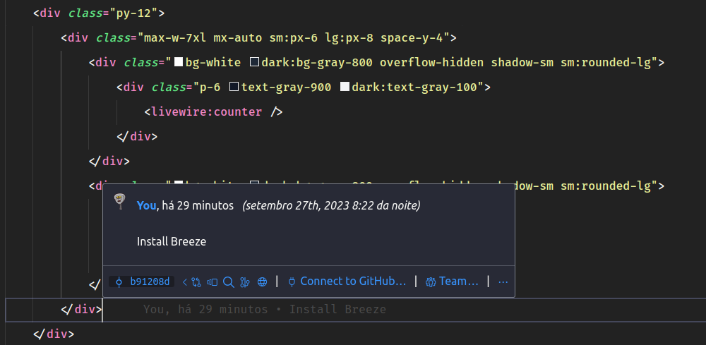

### Deep Dive in Livewire V3
- [Livewire](https://livewire.laravel.com/) A conexão entre o back-end e o front-end.

Installing Livewire
```bash
composer require livewire/livewire
```
### Criando um componente Livewire
Existem duas maneiras de criar um componente Livewire.
```bash
php artisan make:livewire counter
```
O comando acima criará um componente Livewire em `app/Livewire/Counter.php` e um arquivo de visualização em `resources/views/livewire/counter.blade.php`.

```bash
php artisan make:livewire counter --inline
```
O comando acima criará um componente Livewire em `app/Livewire/Counter.php`.

### Renderizando um componente Livewire

### Propriedades
